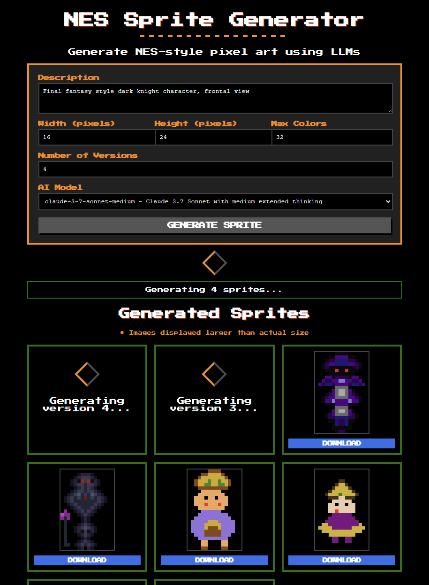

# NES Sprite Generator

Generate NES-style pixel art sprites using AI models.

## Features

- Generate 8-bit style pixel art with customizable dimensions and color palette
- Multiple AI model support (OpenAI, Claude, Gemini)
- Command-line interface
- Web interface for easy use
- Optimized palette management for true NES aesthetics

## Installation

```bash
# Install from the repository
git clone https://github.com/MatthewPDingle/nes-sprite-generator.git
cd nes-sprite-generator
pip install -e .
```

## Command Line Usage

```bash
# Generate a single sprite
nes-sprite-generator single "A warrior with sword and shield" --width 16 --height 24 --colors 32 --model "claude-3-7-sonnet-low"

# List available models
nes-sprite-generator models
```

Options:
- `--width`: Width of sprite in pixels (default: 16)
- `--height`: Height of sprite in pixels (default: 16)
- `--colors`: Maximum colors in palette (default: 16)
- `--style`: Style description (default: "2D pixel art")
- `--model`: AI model to use (default: "gpt-4o")
- `--versions`: Number of versions to generate (default: 1)
- `--output`: Output filename (default: "pixel_art.png")

## Web Interface

```bash
# Start the web server
python run_webapp.py
```

Then open http://localhost:5000 in your browser.



## API Usage

```python
from nes_sprite_generator.api import generate_sprite, list_available_models

# Generate a sprite
result = generate_sprite(
    prompt="A ninja character", 
    width=16, 
    height=24, 
    colors=32, 
    model="gpt-4o",
    output="ninja.png"
)

# Get available models
models = list_available_models()
```

## Supported Models

- OpenAI: GPT-4o, GPT-4o-mini, o3-mini
- Anthropic: Claude 3.7 Sonnet, Claude 3 Opus
- Google: Gemini Pro, Gemini Flash

### Special Models

- **gemini-2.0-flash-exp**: Uses direct image generation capabilities instead of pixel grid generation, resulting in higher quality sprites. The generated image undergoes a specialized post-processing pipeline to create true NES-style sprites.

## Requirements

- Python 3.8+
- Pillow
- AI API keys for the respective services